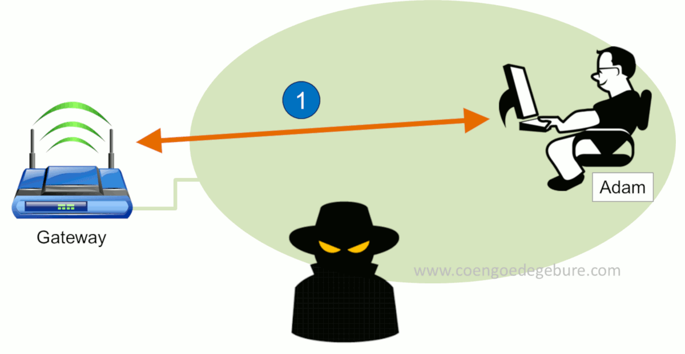

# `ft_malcolm`


In this first project of network security, you will implement the Address Resolution Protocol spoofing/poisoning method, which is one of the most basic Man In The Middle attacks. This attack is possible using a vulnerability present in the the way the ARP protocol works and interacts in a network.



**Why is this kind of attack still possible ?**

- ARP doesn't verify if the sender of an ARP reply is actually the legitimate owner of the IP address.
- Hosts trust and update their ARP cache based on any ARP reply they receive, even unsolicited ones : trust is assumed without verification.

**Ok, but should I worry ?**
Well, not really :

- ARP spoofing only works on local networks.
- even if an attacker successfully intercepts traffic, they often can't read or modify the content if its encrypted (HTTPS, TLS, SSL).
- I noticed that wireshark will give a warning when doing the spoofing, so I guess if a network is properly configured, it could prevent arp spoofing attacks.

## Usage

```sh
./ft_malcolm [source_ip] [source_mac] [target_ip] [target_mac]
```

### Parameters

- `source_ip`: The IP address you're spoofing (usually the router's IP)
- `source_mac`: Your machine's MAC address
- `target_ip`: The IP address of the target machine (victim)
- `target_mac`: The MAC address of the target machine
- `-v` (optionnal) : Verbose mode - print relevant information

### Make it work

- Setup 2 virtual machines. Make sure they can communicate on the same network (_hint: look at bridged networking_)
- On one VM, run the program
- On the other one, send a broadcast ARP request using the `arping` command, requesting the MAC address of the `source_ip`
  ```sh
  # run with elevated privileges
  arping <source_ip> -c 1
  ```
- The `ft_malcolm` program should send an ARP request to the target. If everything went fine, the arp cache of the target should be updated with the `source_ip` and the `source_mac` ! You can check the arp cache of the target using the `arp` command :
  ```sh
  arp -a
  ```

### Example

Imagine the following network :

```
router:
ip: 192.168.111.2
mac: 00:50:56:e3:15:d1

host 1:
ip: 192.168.111.128
mac: 00:0c:29:b4:fb:46

host 2:
ip: 192.168.111.133
mac: 00:0c:29:71:16:5a
```

And running this command :

```sh
./ft_malcolm 192.168.111.2 00:0c:29:b4:fb:46 192.168.111.133 00:0c:29:71:16:5a
```

In this example:

- We're spoofing the router's IP (192.168.111.2)
- Using our MAC address (00:0c:29:b4:fb:46)
- Targeting a victim at IP 192.168.111.133
- With MAC address 00:0c:29:71:16:5a

## Resources

Before anything, it is mandatory to understand the basics of networking aswell as the ARP protocol in great details.

### Videos

[ What is OSI Model | Real World Examples ](https://www.youtube.com/watch?v=0y6FtKsg6J4)

[ ARP Explained | Address Resolution Protocol ](https://www.youtube.com/watch?v=tXzKjtMHgWI)

[ Address Resolution Protocol (ARP) - Explained with example | Computer network | TechTerms ](https://www.youtube.com/watch?v=EC1slXCT3bg)

[ ARP Poisoning | Man-in-the-Middle Attack ](https://www.youtube.com/watch?v=A7nih6SANYs)

### Text

RFCs can be hard to read but they got everything.

- RFC 826 - An Ethernet Address Resolution Protocol. Understanding the ARP protocol
- RFC 7042 - Understanding why the ARP protocol can be exploited for a MITM.

`/usr/include/linux/if_arp.h` - arp structure and defines
`/usr/include/linux/if_ether.h` - ethernet

`arping` - send ARP ping to host

`netdiscover` - get info about network

`ip a` / `ip link show` / `ip r` - get info about network interaces

`sudo ip -s -s neigh flush all` - flush arp cache
